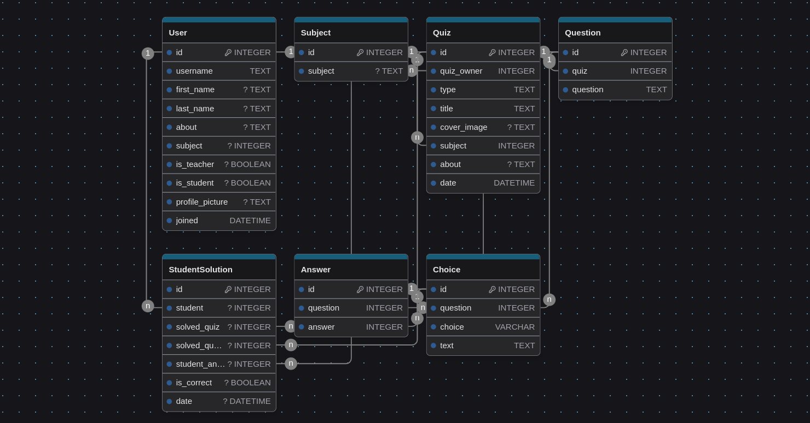

# TestSkool
TestSkool is a quiz web app for teachers, and quiz solving platform for students.

Teachers can create quizzes for students, and students can solve prepared quizzes by teachers.

## Incoming TestSkool features:

### Login and Register:
**Dedicated Login and Register pages**: To Login to system and Register a new account are located on separate pages.

### My Profile:
**Profile Management**: Users will be able to update their profiles, including profile photos, through the "My Profile" section.

- **Teacher View:** If the user is a teacher, they also will be able to display the quizzes they have created.

- **Student View:** If the user is a student, they also will be able to display all the quizzes they have completed. Additionally, there will be interactive charts to showing their performances in detail.

### Home Page:
- **Quiz Discovery**: Users will be able to browse all quizzes created by teachers in a card format.

- **Quiz Details**: Clicking on a quiz will trigger a drawer to show details about clicked quiz. There will be a close button, start button to solve quiz and a download button to download the quiz as pdf.

### Quiz Solving Page:
Students will be able to solve quizzes they view on the Home page or a teacher's profile on a dedicated quiz-solving page.

### Create Quiz Button:
Teachers will be able to create quizzes with customizable settings for quiz type, number of questions, and number of answer options. This button will be available only for teachers.

### Teachers Page:
In this teachers listing page, teachers will be appeared as cards. Any user also will be able to search for any teacher.

### Students Page:
Same as Teachers page for students. Since students cannot prepare quizzes, the quizzes they have solved and the charts showing their performance will be shown.

## Milestones
TestSkool is designed as a project with two milestones:

**Milestone 1**: A web application for teachers to prepare quizzes and download them as PDFs. Quiz solving and performance demonstration for students.

**Milestone 2**: Social addition. Users will be able to follow each other, send messages to each other and have a live quiz solving sessions with teachers.


## Technology Stack
This project still under development. Packages will be changed / added as needs. Also this is Test Driven Development (TDD), you can check tests on actions tab.

Testskool uses Django with DRF on the back-end, and ReactJS on the front-end.

**npm packages used for React JS**:

<table style="border-collapse: collapse; width: 100%;">
  <tr>
    <th style="border: 1px solid #ddd; padding: 8px;">Technology</th>
    <th style="border: 1px solid #ddd; padding: 8px;">Usage</th>
  </tr>

  <tr>
    <td style="border: 1px solid #ddd; padding: 8px;"><a href="https://reactrouter.com/en/main" target="_blank">React Router</a></td>
    <td style="border: 1px solid #ddd; padding: 8px;">Client side routing</td>
  </tr>

  <tr>
    <td style="border: 1px solid #ddd; padding: 8px;"><a href="https://mui.com/" target="_blank">Material UI</a></td>
    <td style="border: 1px solid #ddd; padding: 8px;">UI library</td>
  </tr>

  <tr>
    <td style="border: 1px solid #ddd; padding: 8px;"><a href="https://axios-http.com/" target="_blank">Axios</a></td>
    <td style="border: 1px solid #ddd; padding: 8px;">For HTTP requests</td>
  </tr>

  <tr>
    <td style="border: 1px solid #ddd; padding: 8px;"><a href="https://www.npmjs.com/package/@fontsource/secular-one" target="_blank">Secular One</a></td>
    <td style="border: 1px solid #ddd; padding: 8px;">Heading Font</td>
  </tr>

  <tr>
    <td style="border: 1px solid #ddd; padding: 8px;"><a href="https://www.npmjs.com/package/@fontsource/merriweather-sans" target="_blank">Merriweather Sans</a></td>
    <td style="border: 1px solid #ddd; padding: 8px;">Body Font</td>
  </tr>

  <tr>
    <td style="border: 1px solid #ddd; padding: 8px;"><a href="https://eslint.org/" target="_blank">Eslint</a></td>
    <td style="border: 1px solid #ddd; padding: 8px;">Linting</td>
  </tr>

  <tr>
    <td style="border: 1px solid #ddd; padding: 8px;"><a href="https://vitest.dev/" target="_blank">Vitest</a></td>
    <td style="border: 1px solid #ddd; padding: 8px;" rowspan="5">Testing</td>
  </tr>

  <tr>
    <td style="border: 1px solid #ddd; padding: 8px;"><a href="https://testing-library.com/docs/react-testing-library/intro" target="_blank">React Testing Library</a></td>
  </tr>

  <tr>
    <td style="border: 1px solid #ddd; padding: 8px;"><a href="https://www.npmjs.com/package/@happy-dom/jest-environment" target="_blank">Happy DOM</a></td>
  </tr>

  <tr>
    <td style="border: 1px solid #ddd; padding: 8px;"><a href="https://www.npmjs.com/package/@testing-library/user-event" target="_blank">user-event</a></td>
  </tr>

  <tr>
    <td style="border: 1px solid #ddd; padding: 8px;"><a href="https://mswjs.io/" target="_blank">MSW</a></td>
  </tr>
</table>

(See **packages.json** file in ./frontend directory for details.)

*Please note that react files created with <a href="https://vitejs.dev/" target="_blank">Vite</a>.*


**python packages used for Django**:
<table style="border-collapse: collapse; width: 100%;">
  <tr>
    <th style="border: 1px solid #ddd; padding: 8px;">Technology</th>
    <th style="border: 1px solid #ddd; padding: 8px;">Usage</th>
  </tr>

  <tr>
    <td style="border: 1px solid #ddd; padding: 8px;"><a href="https://www.djangoproject.com/" target="_blank">Django</a></td>
    <td style="border: 1px solid #ddd; padding: 8px;">Back-end framework</td>
  </tr>

  <tr>
    <td style="border: 1px solid #ddd; padding: 8px;"><a href="https://www.django-rest-framework.org/" target="_blank">Django Rest Framework</a></td>
    <td style="border: 1px solid #ddd; padding: 8px;">API management</td>
  </tr>

  <tr>
    <td style="border: 1px solid #ddd; padding: 8px;"><a href="https://pypi.org/project/django-cors-headers/" target="_blank">Django Cors Headers</a></td>
    <td style="border: 1px solid #ddd; padding: 8px;">Same site rules for requests</td>
  </tr>

  <tr>
    <td style="border: 1px solid #ddd; padding: 8px;"><a href="https://pypi.org/project/python-dotenv/" target="_blank">python-dotenv</a></td>
    <td style="border: 1px solid #ddd; padding: 8px;">Environment variable management</td>
  </tr>
</table>

(See **requirements.txt** file in the root directory for details.)

## Installation Guide
Do you want to run this project in your local machine?
### Installation instructions:

*__Disclaimer__: This project serves no purpose other than its own. The developer and the project are not liable for any material or immaterial damages that may arise before, during, or after the installation and/or use of this project.*

**Notes:**
- This instructions are written only to run in your local machine. To run in a cloud server or derivatives, you will need special configurations.
- This project developed in <a href="https://www.debian.org/" target="_blank">Debian OS</a>, and instructions will be suit for Debian OS.
- There are two methods to install and run this project. The first method is easiest, and second method is advanced one. The first method uses <a href="https://www.docker.com/" target="_blank">Docker</a> and second method is manual setup.

**Method 1- Run the project with Docker:**

This is the easiest way to run this project in your local machine.

Install <a href="https://www.docker.com/" target="_blank">Docker and Docker Compose</a>

Download TestSkool repository anywhere in your system:
```bash
git clone https://github.com/levent-86/testskool.git
```

After you download TestSkool repository to your machine, you will see `docker-compose.yml` file in the root (testskool/) directory. Under `backend:` section, you will find `environment:` subsection. Specify your own username, email and password:
```yaml
  - DJANGO_SUPERUSER_USERNAME=yourUsername
  - DJANGO_SUPERUSER_EMAIL=yourEmail@example.com
  - DJANGO_SUPERUSER_PASSWORD=yourPassword
```
if you omit or consider to leave it as is, your default username, email and password will stay as;
```
username: admin
email: admin@example.com
password: 12345
```

After you specify your superuser informations or consider to omit, open a terminal in the root directory (testskool/) or move your terminal into root directory:
```bash
cd testskool/
```
To containerize TestSkool;

If you installed Docker Compose as plugin:
```bash
sudo docker compose build
```
If you installed Docker Compose as stand-alone:
```bash
sudo docker-compose build
```
To run TestSkool;

If you installed Docker Compose as plugin:
```bash
sudo docker compose up
```
If you installed Docker Compose as stand-alone:
```bash
sudo docker-compose up
```
The application will be available for the local machine and other devices on the same network. Terminal will give you two links to redirect you: `Local` and `Network`. Doesn't matter which link you've clicked (like http://localhost:5173/ or http://172.19.0.2:5173/).

Before you start to use TestSkool, you need to add some teacher subjects to database. While application running in your terminal, open your web browser and visit admin site via http://localhost:8000/admin/

Enter your specified username and password (if you omit to specify your username and password, your username is admin and your password is 12345). Under TESTSKOOL header, click on "Subjects" and add some teacher subjects in it (math, art, etc...)

After you add subjects, you're ready for TestSkool experience. Go to http://localhost:5173/ address (or whicever adress you given by terminal on `Local` or `Network` section) to use the application.

**Method 2-Run the project with manual installation:**

This is advanced way to run TestSkool in your local machine.

This is the table showing what technologies TestSkool using:
<table style="border-collapse: collapse; width: 100%;">
  <tr>
    <th style="border: 1px solid #ddd; padding: 8px;">Technology</th>
    <th style="border: 1px solid #ddd; padding: 8px;">version</th>
  </tr>
  <tr>
    <td style="border: 1px solid #ddd; padding: 8px;">Python</td>
    <td style="border: 1px solid #ddd; padding: 8px;">3.11.2</td>
  </tr>
  <tr>
    <td style="border: 1px solid #ddd; padding: 8px;">Node</td>
    <td style="border: 1px solid #ddd; padding: 8px;">20.18.0</td>
  </tr>
  </tr>
  <tr>
    <td style="border: 1px solid #ddd; padding: 8px;">npm</td>
    <td style="border: 1px solid #ddd; padding: 8px;">10.8.2</td>
  </tr>
</table>

After you update/download python and node in your machine, download this repository anywhere in your machine:
```bash
git clone https://github.com/levent-86/testskool.git
```
After you download TestSkool repository to your machine, create .env file in ./backend/backend/ directory and add a secret key in it and save:
```text
'SECRET_KEY' = 'some-secret-key'
```
After you create .env file, open a terminal in the root directory (testskool) or move your terminal into root directory of TestSkool:
```bash
cd testskool/
```
Create an env folder for virtual environment creation:
```bash
python3 -m venv env
```
Now activate virtual environment:
```bash
source env/bin/activate
```
Install the dependencies:
```bash
pip install -r requirements.txt
```
Move your terminal to backend/ directory:
```bash
cd backend/
```
Make migrations for Django database:
```bash
python manage.py makemigrations
```
```bash
python manage.py migrate
```
Create a super user for admin panel usage:
```bash
python manage.py createsuperuser
```
After you specify admin username, email and password, you're ready to run Django server:
```bash
python manage.py runserver
```
Terminal will give you a link (something like http://127.0.0.1:8000/). Copy the link from terminal and paste to your web browser, and add "admin/" end of the link: `http://127.0.0.1:8000/admin/`

And now you're ready to see admin panel. Enter your Username and Password you specified on super user creation step to see panel.

The database is currently empty. Click on "Subjects" under TESTSKOOL header, and add some teacher subjects (math, art, etc...)

Django backend is ready to serve APIs for frontend. Leave the terminal as is, **DO NOT** close it. Open a new terminal in the frontend/ directory or move new terminal into root directory:
```bash
cd testskool/frontend/
```
Install npm dependencies:
```bash
npm install
```
After installation done, run React frontend:
```bash
npm run dev
```
Terminal will give you a link to click (something like http://localhost:5173/). You're ready to use application on your web browser when you click on it.

*WARNING:* To ensure proper communication between the frontend and backend, be aware of the following CORS rules. Because of Django cors headers' same site rule, Django will response to these three urls only:
```py
CORS_ALLOWED_ORIGINS = [
    "http://localhost:8080",
    "http://localhost:5173",
    "http://127.0.0.1:8000",
]
```
The terminal which is running React, it should provide one of these urls. If not, go to ./backend/backend/ directory and find settings.py file, and add the given url from React terminal to "CORS_ALLOWED_ORIGINS" array inside:
```py
CORS_ALLOWED_ORIGINS = [
    ...,
    "http://yourURL:port",
    ...,
]
```
Make sure to replace yourURL:port with the actual URL and port where your React app is running.

---

### Database schema:
_This database schema has been prepared based on the anticipated needs of the project. Please note that the database schema may change as the needs of the project progress._


Since User table is created out of the box by Django, some fields (like the password field) are intentionally not added to the table.

You can inspect the database on this address: 
<a href="https://drawdb.vercel.app/editor?shareId=15cd8df5886674988c0fcd728d579574" target="_blank">drawDB</a>

---

### File structure:

```bash
.
├── backend
│   ├── backend
│   │   ├── asgi.py
│   │   ├── __init__.py
│   │   ├── settings.py
│   │   ├── urls.py
│   │   └── wsgi.py
│   ├── manage.py
│   └── testskool
│       ├── admin.py
│       ├── apps.py
│       ├── __init__.py
│       ├── migrations
│       │   └── __init__.py
│       ├── models.py
│       ├── serializers.py
│       ├── tests
│       │   ├── __init__.py
│       │   ├── test_register.py
│       │   ├── test_subject.py
│       │   └── test_throttling.py
│       ├── urls.py
│       ├── utils.py
│       └── views.py
├── docker-compose.yml
├── Dockerfile
├── docs
│   └── ts-db-scheme.png
├── entrypoint.sh
├── frontend
│   ├── Dockerfile
│   ├── eslint.config.js
│   ├── index.html
│   ├── package.json
│   ├── package-lock.json
│   ├── public
│   │   ├── about.txt
│   │   ├── android-chrome-192x192.png
│   │   ├── android-chrome-512x512.png
│   │   ├── apple-touch-icon.png
│   │   ├── favicon-16x16.png
│   │   ├── favicon-32x32.png
│   │   ├── favicon.ico
│   │   └── site.webmanifest
│   ├── src
│   │   ├── App.tsx
│   │   ├── components
│   │   │   ├── AlertMessages.tsx
│   │   │   ├── navbar
│   │   │   │   └── NavbarDrawer.tsx
│   │   │   └── Navbar.tsx
│   │   ├── constants
│   │   │   ├── endpoints.ts
│   │   │   └── headers.ts
│   │   ├── main.tsx
│   │   ├── pages
│   │   │   ├── CreateQuiz.tsx
│   │   │   ├── Faq.tsx
│   │   │   ├── Home.tsx
│   │   │   ├── Login.tsx
│   │   │   ├── MyProfile.tsx
│   │   │   ├── NoPage.tsx
│   │   │   ├── Register.tsx
│   │   │   ├── Students.tsx
│   │   │   └── Teachers.tsx
│   │   ├── services
│   │   │   └── api.ts
│   │   ├── __tests__
│   │   │   ├── Navbar.test.tsx
│   │   │   └── Register.test.tsx
│   │   ├── themes
│   │   │   ├── fonts.ts
│   │   │   └── theme.ts
│   │   ├── @types
│   │   │   └── fonts.d.ts
│   │   └── vite-env.d.ts
│   ├── tsconfig.app.json
│   ├── tsconfig.json
│   ├── tsconfig.node.json
│   ├── vite.config.ts
│   └── vitest.config.ts
├── README.md
└── requirements.txt
```
(This structure taken via `tree` command on terminal.)

**Directory Explanations:**

**./**: Root directory. Contains docs, backend and frontend folders, Docker-related files, the README.md and python's requirements.txt file.

**./docs/**: Contains informational materials, such as database scheme of the project.

**./backend/**: The main directory for the Django backend. Contains the backend and testskool folders, as well as manage.py.

**./backend/backend/**: Contains the main configuration and URL setting files for the Django application.

**./backend/testskool/**: Contains the application's admin panel, migrations, models, serializers, views, URLs, utility functions, and tests directory for the Django app.

**./backend/testskool/migrations/**: Contains migration files for Django database.

**./backend/testskool/tests**:Contains test files for Django.

**./frontend/**: The main directory for the React JS frontend. Contains configuration files for TypeScript, Vite, Vitest, Docker, Eslint, as well as the main index.html file. Also public and src folders are inside of this directory.

**./frontend/public/**: Contains favicons in different sizes, related files, and webmanifest file.

**./frontend/src/**: The source code for the web app's frontend. Includes the main TypeScript files, and folders for components, constants, pages, services, themes, types, and tests.

**./frontend/src/components/**: Contains the core components of the frontend app, such as Navbar.tsx and AlertMessages.tsx.

**./frontend/src/constants/**: Contains endpoints.ts file for URLs endpoints, and headers.ts file for HTTP request headers.

**./frontend/src/components/navbar/**: Contains NavbarDrawer.tsx, which is a part of the Navbar.tsx component.

**./frontend/src/pages/**: Contains the individual pages for the web app.

**./frontend/src/services/**: Contains api.ts, which manages the Axios instance for API requests.

**./frontend/src/__ tests__/**: Contains test files for the frontend, using Vitest for testing.

**./frontend/src/themes/**: Contains theme configuration files to customize Material UI components.

**./frontend/src/@types/**: Contains custom type declaration files for TypeScript.

November 2024

<a href="https://www.linkedin.com/in/mustafaleventfidanci/" target="_blank">Mustafa Levent Fidancı</a>
